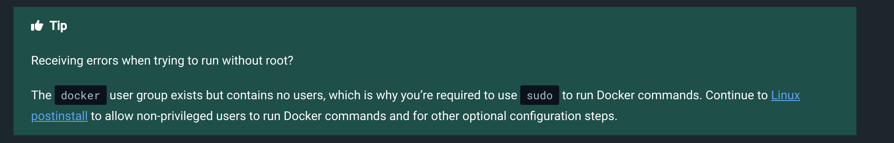

# lottery-backend-service
## The Lottery service
Implement Lottery API service. It should be a simple HTTP server that responds to
POST /ticket:
● with HTTP 200 if the request is successful and ticket is stored into storage;
● with HTTP 410 if out of tickets;
● with HTTP 403 if users try to issue a ticket again.

## Requirements:
● Users should get the response as fast as possible;
● Give out exactly 30 tickets;
● Each user can only get one ticket;
● Means to test the system with ~30 unique users;
● Create a service to test the system

## Going Further
● Provide examples of potential bottlenecks.
● How would this service work for 100M tickets? What would be different?
● What changes functionality-wise would you suggest to address more users?

Minimal [Spring Boot](http://projects.spring.io/spring-boot/) sample app.

For building and running the application you need:

- [JDK 17](http://www.oracle.com/technetwork/java/javase/downloads/jdk8-downloads-2133151.html)
- [Maven](https://maven.apache.org)
- [Docker](https://www.docker.com/)
- [Docker Compose](https://www.docker.com/)
- [Redis](https://redis.io/)
- [Postgres](https://www.postgresql.org/)

## Running the application locally

There are several ways to run a Spring Boot application on your local machine. One way is to execute the `main` method in the `*.Application` class from your IDE.

Alternatively you can use the [Spring Boot Maven plugin](https://docs.spring.io/spring-boot/docs/current/reference/html/build-tool-plugins-maven-plugin.html) like so:

```shell
mvn clean
mvn compile package -DskipTests=true
mvn spring-boot:run
```

## Run the application using docker-compose

```shell
docker-compose -f docker-compose.yaml build
docker-compose -f docker-compose.yaml up
docker-compose -f docker-compose.yaml down
```

## Run the application backend-service/frontend-service

## Backend-service (http://localhost:8080/swagger-ui/index.html#)
```shell
mvn clean
mvn compile package -DskipTests=true
mvn spring-boot:run
```

## Frontend-service (http://localhost:9090)
```shell
yarn
yarn build
yarn start
```

## May see error while running test cases.

